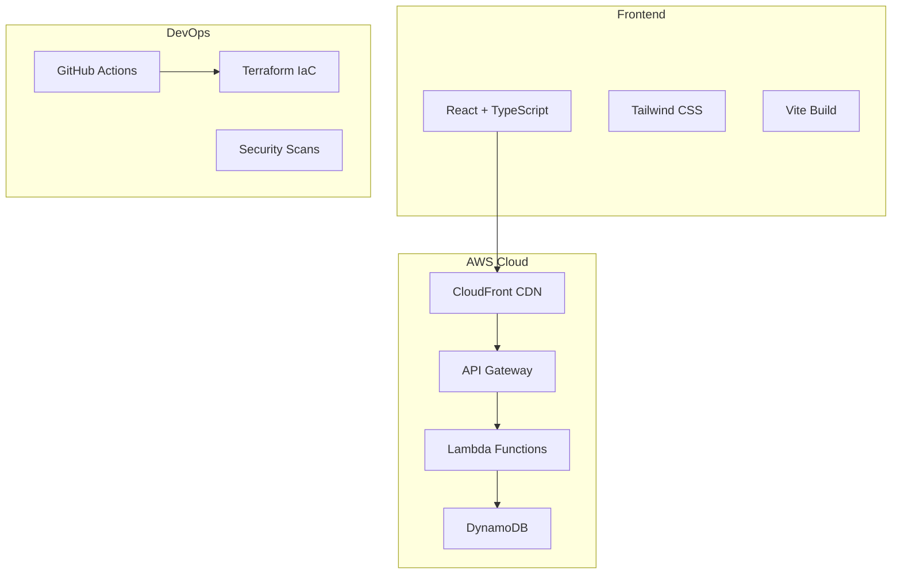

# 📊 VibeSheets - Modern Timesheet Management

[](https://github.com/yourusername/vibesheets/actions/workflows/terraform-deploy.yml)
[](https://github.com/yourusername/vibesheets/actions/workflows/frontend-deploy.yml)
[](https://github.com/yourusername/vibesheets/actions/workflows/security-audit.yml)

A modern, cloud-native timesheet management application built with React + TypeScript frontend and AWS serverless backend infrastructure.

**Live Application**: https://vibesheets.com

## ✨ Features

🎨 **Beautiful UI**: Glassmorphism design with smooth animations  
⚡ **Lightning Fast**: React 18 with Vite for optimal performance  
🔐 **Secure**: Auth0 authentication with JWT tokens  
☁️ **Serverless**: AWS Lambda functions with DynamoDB  
📱 **Responsive**: Mobile-first design that works everywhere  
🚀 **CI/CD**: Automated deployments with GitHub Actions  
🛡️ **Enterprise Ready**: Security scans and monitoring included  

## 🏗️ Architecture



## 🚀 Quick Start

### Prerequisites
- Node.js 18+
- AWS Account
- Terraform 1.6+

### Development Setup
```bash
# Clone the repository
git clone https://github.com/yourusername/vibesheets.git
cd vibesheets

# Install dependencies
npm install

# Start development server
npm run dev
```

Visit `http://localhost:3000` to see the application.

### Production Deployment
```bash
# Deploy infrastructure
cd Backend/Terraform
terraform init
terraform apply

# Deploy frontend
npm run build
aws s3 sync dist/ s3://your-bucket
```

See [Deployment Guide](./docs/DEPLOYMENT.md) for detailed instructions.

## 📚 Documentation

- [🏗️ Architecture Overview](./docs/ARCHITECTURE.md)
- [🚀 Deployment Guide](./docs/DEPLOYMENT.md)
- [📋 API Documentation](./docs/API.md)
- [🔒 Backend Deployment](./BACKEND_DEPLOYMENT.md)

## 🛠️ Technology Stack

### Frontend
- **React 18** - Modern UI framework
- **TypeScript** - Type-safe development
- **Tailwind CSS** - Utility-first styling
- **Vite** - Fast build tooling
- **React Hook Form** - Elegant form handling

### Backend
- **AWS Lambda** - Serverless functions
- **API Gateway** - REST API management
- **DynamoDB** - NoSQL database
- **Auth0** - Authentication service
- **Terraform** - Infrastructure as Code

### DevOps
- **GitHub Actions** - CI/CD pipelines
- **AWS CloudWatch** - Monitoring & logging
- **Checkov/TFSec** - Security scanning
- **CloudFront** - Global CDN

## 🔒 Security Features

✅ JWT-based authentication  
✅ CORS protection  
✅ Input validation & sanitization  
✅ Automated security scanning  
✅ Secrets management  
✅ Least-privilege IAM policies  

## 📊 Project Structure

```
vibesheets/
├── 📁 src/                    # React application source
│   ├── 📁 components/         # Reusable UI components
│   ├── 📁 pages/             # Application pages
│   ├── 📁 hooks/             # Custom React hooks
│   ├── 📁 services/          # API integration
│   └── 📁 types/             # TypeScript definitions
├── 📁 Backend/Terraform/      # Infrastructure as Code
│   ├── 📁 lambda_functions/   # Serverless functions
│   └── 📄 *.tf               # Terraform configuration
├── 📁 .github/workflows/      # CI/CD pipelines
├── 📁 docs/                  # Technical documentation
└── 📄 README.md
```

## 🎯 Business Features

### Free Tier
- ✅ One active project
- ✅ Unlimited time tracking
- ✅ Basic reporting
- ✅ CSV export

### Premium Features
- 🚀 Unlimited projects
- 📊 Advanced analytics
- 💰 Invoice generation
- 🔄 Team collaboration

## 🔄 Development Workflow

1. **Feature Development**: Create feature branch
2. **Pull Request**: Automated testing & security scans
3. **Code Review**: Team review process
4. **Merge**: Automatic deployment to staging
5. **Production**: Manual promotion with approval

## 📈 Performance

- ⚡ **First Load**: < 2 seconds
- 🔄 **API Response**: < 500ms average
- 📱 **Mobile Optimized**: 95+ Lighthouse score
- 🌍 **Global CDN**: Sub-second loading worldwide

## 🤝 Contributing

1. Fork the repository
2. Create your feature branch (`git checkout -b feature/amazing-feature`)
3. Commit your changes (`git commit -m 'Add amazing feature'`)
4. Push to the branch (`git push origin feature/amazing-feature`)
5. Open a Pull Request

## 📝 License

This project is licensed under the MIT License - see the [LICENSE](./LICENSE) file for details.

## 👨‍💻 Author

**Your Name**
- GitHub: [@yourusername](https://github.com/yourusername)
- LinkedIn: [Your LinkedIn](https://linkedin.com/in/yourprofile)
- Email: your.email@example.com

## 🙏 Acknowledgments

- Auth0 for authentication services
- AWS for cloud infrastructure
- React team for the amazing framework
- Open source community for inspiration

---

⭐ **Star this repository if you find it helpful!**# vibesheets-web-app
