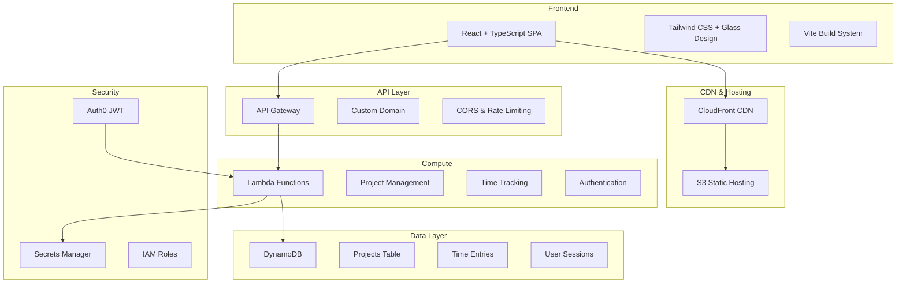

# 🏗️ Architecture Overview

VibeSheets is a modern, cloud-native timesheet management application built with a serverless-first approach.

## 🎯 System Architecture



## 🔧 Technology Stack

### Frontend
- **Framework**: React 18 with TypeScript
- **Styling**: Tailwind CSS with custom glassmorphism design
- **Build Tool**: Vite for fast development and optimized builds
- **State Management**: Custom hooks with React Context
- **Routing**: React Router for SPA navigation
- **Form Handling**: React Hook Form with Zod validation

### Backend
- **Compute**: AWS Lambda (serverless functions)
- **API**: AWS API Gateway with REST endpoints
- **Database**: Amazon DynamoDB (NoSQL)
- **Authentication**: Auth0 with JWT tokens
- **Infrastructure**: Terraform for Infrastructure as Code

### DevOps & CI/CD
- **Version Control**: Git with GitHub
- **CI/CD**: GitHub Actions
- **Infrastructure**: Terraform Cloud state management
- **Monitoring**: AWS CloudWatch
- **Security**: Automated security scans (Checkov, TFSec)

## 📊 Data Flow

### 1. User Authentication
```
User → Auth0 → JWT Token → API Gateway → Lambda → DynamoDB
```

### 2. Project Management
```
React App → API Gateway → Create/Get/Update/Delete Project λ → DynamoDB Projects Table
```

### 3. Time Tracking
```
Clock In/Out → API Gateway → Time Tracking λ → DynamoDB Time Entries
```

## 🏛️ Infrastructure Components

### Compute Layer
- **Lambda Functions**: 10+ serverless functions for business logic
- **API Gateway**: RESTful API with custom domain
- **CloudFront**: Global CDN for frontend assets

### Data Layer
- **DynamoDB Tables**:
  - `projects` - Project metadata and configuration
  - `time_entries` - Time tracking records
  - `user_sessions` - Active session management
  - `user_settings` - User preferences

### Security Layer
- **Auth0**: External identity provider
- **AWS Secrets Manager**: Secure credential storage
- **IAM Roles**: Least-privilege access control
- **JWT Validation**: Token-based authentication

## 🔄 Development Workflow

### Local Development
1. **Frontend**: Vite dev server with hot reload
2. **Data**: localStorage fallback for offline development
3. **API**: Mock responses for rapid prototyping

### Production Deployment
1. **Infrastructure**: Terraform applies AWS resources
2. **Backend**: Lambda functions deployed via Terraform
3. **Frontend**: Built assets deployed to S3/CloudFront
4. **Monitoring**: CloudWatch logs and metrics

## 📈 Scalability Considerations

### Horizontal Scaling
- **Lambda**: Auto-scales to handle traffic spikes
- **DynamoDB**: On-demand pricing scales automatically
- **CloudFront**: Global edge locations

### Performance Optimization
- **Frontend**: Code splitting and lazy loading
- **API**: Lambda cold start optimization
- **Database**: Efficient indexing strategies
- **CDN**: Asset caching and compression

## 🔒 Security Architecture

### Authentication & Authorization
- **Multi-provider**: Auth0 supports Google OAuth and email/password
- **JWT Tokens**: Stateless authentication
- **User Isolation**: Data partitioned by user_id

### Infrastructure Security
- **Network**: VPC isolation (if needed)
- **Encryption**: At-rest and in-transit encryption
- **Access Control**: IAM policies with minimal permissions
- **Secrets**: Centralized secret management

## 🚀 Deployment Strategy

### Blue-Green Deployment
- **Infrastructure**: Terraform manages state transitions
- **API**: API Gateway stages for environment separation
- **Frontend**: Atomic S3 deployments with CloudFront invalidation

### Rollback Strategy
- **Infrastructure**: Terraform state rollback
- **Lambda**: Function versioning and aliases
- **Frontend**: S3 version management

## 📊 Monitoring & Observability

### Metrics
- **Application**: Custom CloudWatch metrics
- **Infrastructure**: AWS native monitoring
- **User Experience**: Frontend performance tracking

### Logging
- **Structured Logging**: JSON format for easy parsing
- **Centralized**: CloudWatch Logs aggregation
- **Alerting**: CloudWatch Alarms for critical events

## 🎯 Business Logic

### Free Tier Limitations
- **Projects**: Maximum 1 active project per user
- **Validation**: Enforced at API level
- **Upgrade Path**: Stripe integration for premium features

### Data Consistency
- **Eventually Consistent**: DynamoDB standard behavior
- **Strong Consistency**: When required for critical operations
- **Conflict Resolution**: Last-writer-wins strategy