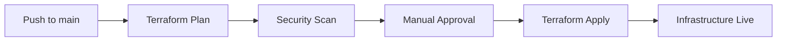
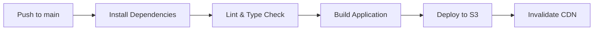

# 🚀 Deployment Guide

This guide covers the complete deployment process for VibeSheets to AWS using Infrastructure as Code.

## 📋 Prerequisites

### Required Tools
- [AWS CLI](https://aws.amazon.com/cli/) configured with appropriate credentials
- [Terraform](https://www.terraform.io/downloads.html) v1.6.0+
- [Node.js](https://nodejs.org/) v18+
- [Git](https://git-scm.com/) for version control

### AWS Account Setup
1. **IAM User** with programmatic access
2. **Required Permissions**:
   - Lambda full access
   - DynamoDB full access
   - API Gateway full access
   - S3 full access
   - CloudFront full access
   - Route53 full access
   - IAM role management
   - Secrets Manager access

### Domain Requirements
- **Domain ownership** of your target domain (e.g., `yourdomain.com`)
- **Route53 hosted zone** configured for the domain

## 🔧 Environment Setup

### 1. Clone Repository
```bash
git clone https://github.com/yourusername/vibesheets.git
cd vibesheets
```

### 2. Configure Terraform Backend
```bash
# Create S3 bucket for Terraform state
aws s3 mb s3://your-terraform-state-bucket

# Create DynamoDB table for state locking
aws dynamodb create-table \
  --table-name terraform-locks \
  --attribute-definitions AttributeName=LockID,AttributeType=S \
  --key-schema AttributeName=LockID,KeyType=HASH \
  --billing-mode PAY_PER_REQUEST
```

### 3. Configure Variables
```bash
cd Backend/Terraform
cp terraform.tfvars.example terraform.tfvars
```

Edit `terraform.tfvars`:
```hcl
domain_name = "yourdomain.com"
project_name = "vibesheets"
environment = "prod"
```

## 🏗️ Infrastructure Deployment

### 1. Initialize Terraform
```bash
terraform init \
  -backend-config="bucket=your-terraform-state-bucket" \
  -backend-config="key=vibesheets/terraform.tfstate" \
  -backend-config="region=us-east-1"
```

### 2. Plan Deployment
```bash
terraform plan -var-file="terraform.tfvars"
```

### 3. Deploy Infrastructure
```bash
terraform apply -var-file="terraform.tfvars"
```

This creates:
- **4 DynamoDB Tables**: projects, time_entries, user_sessions, user_settings
- **10+ Lambda Functions**: All API endpoints
- **API Gateway**: REST API with custom domain
- **S3 + CloudFront**: Frontend hosting
- **Route53 + ACM**: DNS and SSL certificates

## 🔐 Configure Authentication

### 1. Create Auth0 Application
1. Sign up at [Auth0](https://auth0.com/)
2. Create a new Single Page Application
3. Configure allowed callback URLs: `https://yourdomain.com`
4. Note the Domain and Client ID

### 2. Store Auth0 Secrets
```bash
aws secretsmanager put-secret-value \
  --secret-id vibesheets-auth-config-prod \
  --secret-string '{
    "auth0_domain": "your-domain.auth0.com",
    "auth0_client_id": "your-client-id",
    "auth0_client_secret": "your-client-secret"
  }'
```

## 🎨 Frontend Deployment

### 1. Install Dependencies
```bash
npm install
```

### 2. Build for Production
```bash
npm run build
```

### 3. Deploy to S3
```bash
aws s3 sync dist/ s3://your-s3-bucket-name --delete
```

### 4. Invalidate CloudFront
```bash
aws cloudfront create-invalidation \
  --distribution-id YOUR_DISTRIBUTION_ID \
  --paths "/*"
```

## 🤖 GitHub Actions Setup

### 1. Repository Secrets
Configure these secrets in your GitHub repository:

```bash
AWS_ACCESS_KEY_ID=AKIA...
AWS_SECRET_ACCESS_KEY=...
TF_STATE_BUCKET=your-terraform-state-bucket
S3_BUCKET_NAME=your-s3-bucket-name
DOMAIN_NAME=yourdomain.com
```

### 2. Automatic Deployments
Push to `main` branch triggers:
1. **Infrastructure**: Terraform plan and apply
2. **Frontend**: Build, test, and deploy to S3
3. **Security**: Automated security scans

## 🔄 CI/CD Pipeline

### Infrastructure Pipeline


### Frontend Pipeline


## 🔍 Verification

### 1. Test API Endpoints
```bash
# Get Auth configuration
curl https://api.yourdomain.com/prod/auth

# Test with authentication
curl -H "Authorization: Bearer $JWT_TOKEN" \
     https://api.yourdomain.com/prod/projects
```

### 2. Verify Frontend
Visit `https://yourdomain.com` and test:
- User authentication
- Project creation
- Time tracking
- Data persistence

### 3. Monitor Logs
```bash
# Lambda function logs
aws logs tail /aws/lambda/vibesheets-create-project-prod

# API Gateway logs
aws logs tail API-Gateway-Execution-Logs_YOUR_API_ID/prod
```

## 📊 Monitoring & Alerting

### CloudWatch Dashboards
- API response times
- Lambda execution metrics
- DynamoDB read/write capacity
- Error rates and 4xx/5xx responses

### Alerts
- High error rates
- Lambda timeout errors
- DynamoDB throttling
- SSL certificate expiration

## 💰 Cost Optimization

### Estimated Monthly Costs
- **Lambda**: $5-15 (1M requests free tier)
- **DynamoDB**: $2-10 (25GB free tier)
- **API Gateway**: $3-7 (1M requests free tier)
- **S3 + CloudFront**: $1-5
- **Route53**: $0.50 per hosted zone

**Total**: ~$10-40/month depending on usage

### Cost Reduction Tips
1. **DynamoDB**: Use on-demand pricing for variable workloads
2. **Lambda**: Optimize function memory allocation
3. **S3**: Use intelligent tiering for infrequently accessed files
4. **CloudFront**: Set appropriate cache headers

## 🔧 Troubleshooting

### Common Issues

#### Terraform Apply Fails
```bash
# Check AWS credentials
aws sts get-caller-identity

# Verify S3 bucket exists
aws s3 ls s3://your-terraform-state-bucket

# Check Terraform state
terraform show
```

#### Lambda Function Errors
```bash
# View recent logs
aws logs describe-log-streams \
  --log-group-name /aws/lambda/vibesheets-create-project-prod

# Test function directly
aws lambda invoke \
  --function-name vibesheets-create-project-prod \
  --payload '{}' \
  response.json
```

#### API Gateway CORS Issues
- Verify OPTIONS methods are configured
- Check CORS headers in Lambda responses
- Confirm API Gateway deployment

#### Auth0 Integration Problems
- Verify callback URLs in Auth0 dashboard
- Check JWT token format and expiration
- Confirm secrets in AWS Secrets Manager

### Recovery Procedures

#### Infrastructure Recovery
```bash
# View Terraform state
terraform state list

# Import existing resources
terraform import aws_lambda_function.create_project function-name

# Force refresh state
terraform refresh
```

#### Database Recovery
```bash
# Create backup
aws dynamodb create-backup \
  --table-name vibesheets-projects-prod \
  --backup-name backup-$(date +%Y%m%d)

# Restore from backup
aws dynamodb restore-table-from-backup \
  --target-table-name vibesheets-projects-prod-restored \
  --backup-arn arn:aws:dynamodb:...
```

## 🎯 Next Steps

1. **Custom Domain SSL**: Verify certificate validation
2. **Monitoring Setup**: Configure CloudWatch dashboards
3. **Backup Strategy**: Set up automated backups
4. **Performance Testing**: Load test API endpoints
5. **Security Audit**: Run penetration testing